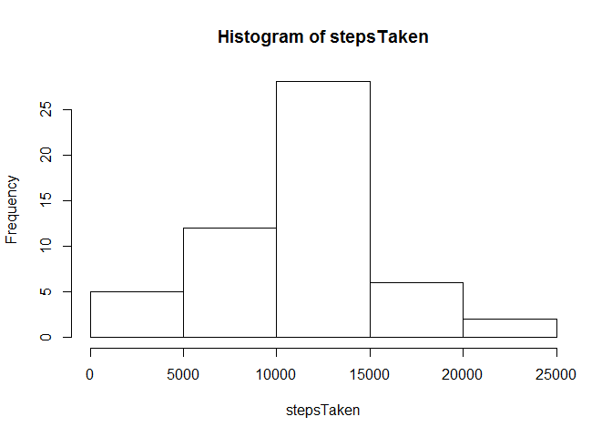
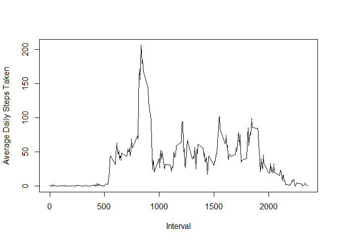
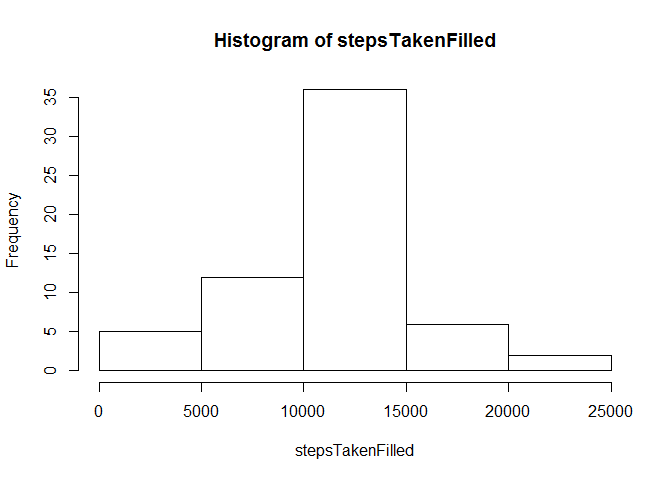
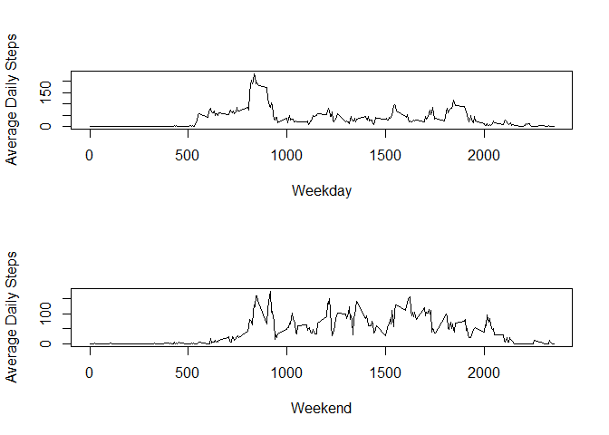

# Reproducible Research Assignment 1
Jon Purnell  
Thursday, February 12, 2015  

## Loading and preprocessing the data

```r
options(scipen = 1)
data <- read.csv("activity.csv",header=T)
```
## What is mean total number of steps taken per day?

```r
stepsTaken <- tapply(data$steps,data$date,sum)
```

### Histogram

```r
hist(stepsTaken)
```

 

### Mean and Median


```r
stepsMean <- mean(stepsTaken,na.rm=T)
stepsMedian <- median(stepsTaken,na.rm=T)
```
Mean total steps taken is 10766.1886792. Median total steps taken is 10765. 

## What is the average daily activity pattern?

A plot of the average steps taken at each 5-minute interval. 


```r
avgDaily <- tapply(data$steps,data$interval,mean,na.rm=T)
plot(unique(data$interval),avgDaily,type="l",xlab="Interval",ylab="Average Daily Steps Taken")
```

 

```r
maxInterval <- unique(data$interval)[which.max(avgDaily)]
```

The highest average of steps taken happened at 835. 

## Imputing missing values


```r
missingIntervals <- is.na(data$steps)
rowsMissing <- sum(missingIntervals)
```
There are 2304 rows missing data. These are filled with the corresponding average daily steps taken for that interval.


```r
data$filledsteps <- data$steps
data$filledsteps[missingIntervals] <- avgDaily
stepsTakenFilled <- tapply(data$filledsteps,data$date,sum)
```

### Stats for filled data


```r
hist(stepsTakenFilled)
```

 

```r
stepsMeanFilled <- mean(stepsTakenFilled,na.rm=T)
stepsMedianFilled <- median(stepsTakenFilled,na.rm=T)
```
Mean total steps taken is 10766.1886792. Median total steps taken is 10766.1886792. 

## Are there differences in activity patterns between weekdays and weekends?


```r
weekends <- weekdays(as.Date(data$date)) %in% c("Sunday","Saturday")
data$WeekOrEnd <- factor(replace(replace(weekends,weekends == T, "Weekend"), weekends == F, "Weekday"))

par(mfrow=c(2,1))
by(data,data$WeekOrEnd,function(x) plot(unique(x$interval),tapply(x$steps,x$interval,mean,na.rm=T),type="l",xlab=x$WeekOrEnd[1],ylab="Average Daily Steps"))
```

 
